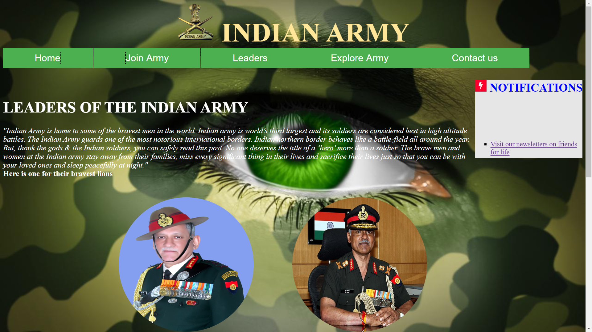
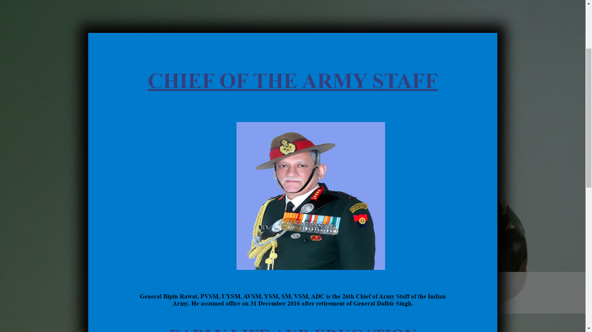
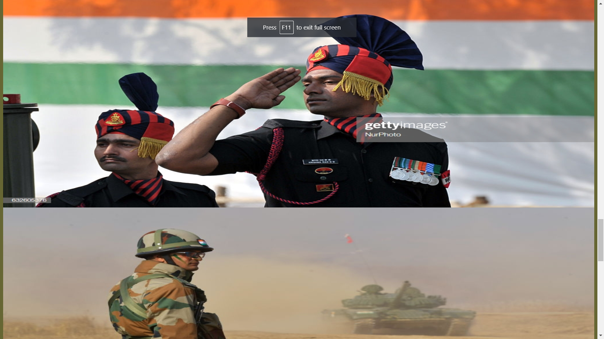
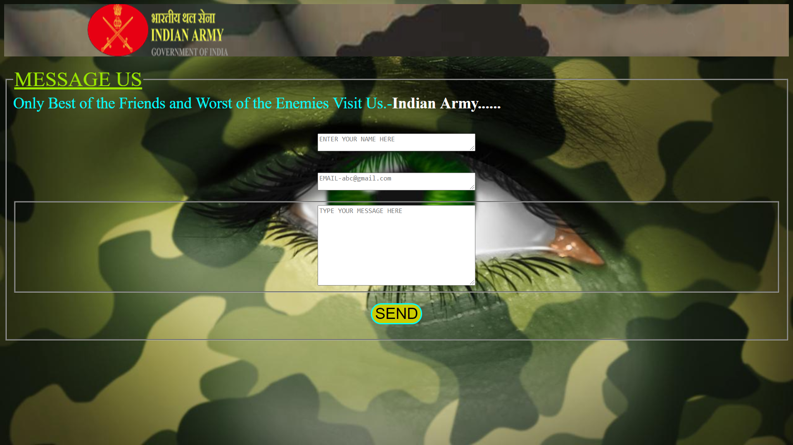

# frontend-army

## Available at: 
https://insaiyann.github.io/frontend-army/

A Website mainly focused on Indian Army. Have functionalities like: Navigation bar, Drop-down menus, CSS styling and images.

## Screenshots: 

